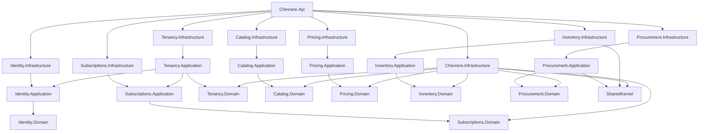

# Arquitectura de Chevrere

## Contexto

Chevrere es una plataforma SaaS + quick-commerce basada en una red de dark stores independientes.

Hacia el consumidor existe una sola marca y una sola aplicación. Internamente, múltiples operadores/asociados operan una o varias dark stores. El backend es único. Esta fase cubre la administración central de asociados y el catálogo comercial (global + por store).

```text
                       CHEVRERE

        ┌────────────────┼────────────────┐
        │                │                │
        ▼                ▼                ▼

 APP CONSUMIDOR    BACK-OFFICE       ADMIN CENTRAL
    Flutter         ASOCIADO            CHEVRERE
   (futuro)         (futuro)            (esta fase)

        │                │                │
        └────────────────┼────────────────┘
                         │
                         ▼

                  CHEVRERE API
                    .NET 10
                MONOLITO MODULAR

                         │
                         ▼

                    PostgreSQL
```

## Por qué monolito modular

No hay todavía escala, equipos ni bounded contexts operativos que justifiquen red, contratos de red, sagas distribuidas o Kubernetes.

Un único deployable reduce costo operacional. Los módulos mantienen fronteras de dominio para poder extraer un servicio más adelante sin reescribir el negocio.

No se usan RabbitMQ, Redis, MongoDB ni microservicios en esta fase.

## Estructura elegida

Se adoptó la separación física Domain / Application / Infrastructure por módulo, más un `SharedKernel` y un `Chevrere.Infrastructure` compartido.

Motivo: el compile-time impide que Domain tome dependencias de EF, Identity o HTTP. Un solo proyecto por módulo no habría dado esa garantía.

`Chevrere.Infrastructure` concentra el `DbContext` único, ASP.NET Identity y auditoría. Un solo contexto permite que el onboarding (`CreateFranchisee`) sea atómico: Tenant + Franchisee + Owner + Store + Subscription se confirman en la misma transacción.

No hay repositorios genéricos. Cada módulo expone puertos de aplicación (`ITenancyStore`, `IIdentityProvisioning`, `ISubscriptionProvisioning`, `ICatalogStore`, `IProcurementStore`) implementados en su Infrastructure. Cuando un módulo necesita **escribir** en otro, el puerto vive en SharedKernel para que ninguno de los dos referencie al otro: así entra `Procurement` a `Inventory` vía `IInventoryInboundService`.

## Módulos

| Módulo | Responsabilidad |
|---|---|
| Identity | Usuarios, roles, JWT, bootstrap SuperAdmin, provisioning del Owner |
| Tenancy | Tenant, Franchisee, Store, onboarding y ciclo de vida administrativo |
| Subscriptions | Planes SaaS y suscripción del tenant. Distinto de pagos del consumidor |
| Catalog | Catálogo global Chevrere y opt-in comercial por Store |
| Pricing | Precio sugerido global y override por Store; EffectivePrice |
| Inventory | Existencia física por Store: balances + ledger inmutable |
| Procurement | Proveedores, órdenes de compra y recepción de mercancía |

Módulos futuros previstos, no implementados: Orders, Payments, Billing, Operations, Notifications.

## Catálogo

```text
CHEVRERE
   ↓
Category (global)
   ↓
GlobalProduct (global, una presentación = un SKU)
   ↓
StoreProduct (tenant + store)
   ↓
Pricing (Suggested + Store override → EffectivePrice)
   ↓
Procurement (Supplier → PurchaseOrder → GoodsReceipt)
   ↓
Inventory (OnHand / Reserved / Available + ledger)
   ↓
Orders   ← futuro
```

Las flechas describen composición funcional (qué capa responde qué pregunta), no necesariamente project references. Inventory no referencia Pricing ni Catalog Domain; proyecta SKU/Name vía Infrastructure. Procurement no referencia Inventory: mueve stock por el puerto `IInventoryInboundService` de SharedKernel.
`Category` y `GlobalProduct` **no** tienen `TenantId`. Son de la plataforma. `StoreProduct` **sí** pertenece a un tenant y referencia `Store (Id, TenantId)` con FK compuesta.

## Pricing

Chevrere define un **SuggestedPrice** global por producto. Cada Store puede definir un **override**. El precio que aplica es:

```text
EffectivePrice = StoreOverride ?? SuggestedPrice ?? null
```

`Source` derivado: `Store` | `Global` | `None`. Histórico versionado con `ValidFrom`/`ValidTo` (vigente = `ValidTo IS NULL`). Idempotencia de set/remove sin audit falso. Detalle: [ADR-006](adr/ADR-006-pricing-global-suggested-store-override.md).

Orders futuro debe guardar snapshot de precio en el ítem; no recalcular desde histórico.

Disponibilidad comercial efectiva (sin stock todavía en fases previas):

```text
Category.Active AND GlobalProduct.Active AND StoreProduct.Enabled
```

Disponibilidad futura hacia consumidor (no implementada aún):

```text
StoreProduct Enabled AND EffectivePrice != null AND Inventory.Available > 0
```

## Inventory

Cada Store gestiona stock por `GlobalProduct` ofrecido (`StoreProduct`). El estado actual vive en `InventoryItem` (`OnHand`, `Reserved`); la historia en `InventoryMovement` inmutable. `Available` se deriva. Mutaciones manuales (Initialize / Adjust / Waste) exigen `Idempotency-Key`. Detalle: [ADR-007](adr/ADR-007-inventory-ledger-and-balances.md).

## Procurement

El stock también entra por la puerta del proveedor: `Supplier` → `PurchaseOrder` (`Draft` → `Approved` → `PartiallyReceived` → `Received`, o `Cancelled`) → `GoodsReceipt` inmutable.

Recibir mercancía escribe en un solo `SaveChanges`: cantidades de la orden, el recibo con sus líneas, el `InventoryMovement` de tipo `Receipt` (referenciando el `GoodsReceiptItem`), la operación idempotente y la auditoría. Si la store aún no gestionaba stock del producto, el ingreso crea el `InventoryItem` en cero; si ya había, se suma.

Los números de documento (`PO-000001`, `GR-000001`) salen de secuencias PostgreSQL. `POST` de orden y de recepción exigen `Idempotency-Key`; el replay responde el snapshot original del recibo aunque la orden haya avanzado después. Detalle: [ADR-008](adr/ADR-008-procurement-purchase-orders-and-goods-receipts.md).

## Catálogo y ciclo de vida

Desactivar una categoría o un producto global no borra `StoreProduct`. Solo deja de ser comercialmente disponible. Una categoría inactiva no desactiva físicamente sus productos.

No hay jerarquía de categorías en esta fase: evita ciclos y no hay caso de uso de árbol. `SortOrder` + nombre alcanzan. Cada presentación (250ml vs 1.5L) es un `GlobalProduct` distinto.

## Dependencias



Tenancy.Application orquesta el onboarding. Identity y Subscriptions no conocen Tenancy. Pricing e Inventory no dependen de Catalog Application/Domain. Procurement.Application solo alcanza Inventory por `Chevrere.SharedKernel.Inventory`; tests de arquitectura lo verifican en ambos sentidos.

## Multi-tenancy

El tenant **nunca** se toma de un parámetro arbitrario del cliente en superficies de negocio.

La cadena de identidad es:

```text
User autenticado
  → TenantId en el JWT (null si es usuario de plataforma)
  → Roles
  → Policies
  → Query filters de EF Core
```

Filtros globales en `Tenant`, `Franchisee`, `Store`, `Subscription`, `AuditEvent`, `StoreProduct`, `InventoryItem`, `InventoryMovement`, `Supplier`, `PurchaseOrder` y `GoodsReceipt`. `Category` y `GlobalProduct` no se filtran por tenant. Los usuarios de plataforma (`PlatformSuperAdmin`, `PlatformAdmin`, `PlatformSupport`) omiten los filtros. Los endpoints `/api/v1/business/*` no aceptan `tenantId` del request. Una Store ajena responde 404.

`User.TenantId` nulo identifica personal de plataforma. Un Owner siempre nace ligado al tenant creado.

## Tenant vs Franchisee vs Store

```text
Tenant          aislamiento SaaS
  └── Franchisee   empresa / operador
        └── Store    dark store física (1..N)
```

Nunca se asume `FranchiseeId = StoreId`. Una Store no puede crearse si su Franchisee pertenece a otro Tenant: la invariante vive en el dominio y se refuerza con FK + tests.

La dirección exacta de la Store es operacional y no se considera pública.

## Suscripción

`FranchiseeStatus` y `SubscriptionStatus` son independientes.

- Asociado: `Pending`, `Active`, `Suspended`, `Rejected`, `Inactive`
- Suscripción: `Trial`, `Active`, `PastDue`, `GracePeriod`, `Suspended`, `Cancelled`

Suspender un asociado no borra datos. Conserva tenant, empresa, stores, usuarios, histórico y auditoría. La reactivación restaura estados; no recrea entidades.

La suscripción SaaS no es el pago del consumidor. En el futuro:

```text
Order → Store → Franchisee → PaymentConfiguration → Wompi Merchant
```

El backend elegirá el merchant. Esta fase no implementa Wompi, pero el modelo `Tenant → Franchisee → Store` ya permite anclar esa configuración al asociado correcto.

`TrialDays`, `GracePeriodDays` y el precio del plan `STANDARD` son hipótesis configurables, no reglas de negocio permanentes.

## Autenticación y autorización

ASP.NET Core Identity almacena usuarios y hashea contraseñas. La API usa JWT Bearer.

Policies:

| Policy | Roles |
|---|---|
| PlatformStaff | SuperAdmin, Admin, Support (lectura) |
| PlatformOperators | SuperAdmin, Admin (mutaciones) |
| PlatformSuperAdmin | SuperAdmin |
| FranchiseeOwner | Owner del asociado |

Crear, activar, suspender y reactivar asociados, y mutar el catálogo global, exige `PlatformOperators`. `PlatformSupport` puede leer el catálogo, no escribirlo. El Owner habilita/deshabilita productos solo en stores de su tenant.

## Auditoría y correlación

Cada request recibe o genera un `X-Correlation-ID`. Se propaga a logs y a `audit_events`.

Se registran creación de tenant, franchisee, store, owner, subscription, activación, suspensión, reactivación y cambio de plan; mutaciones de Catalog; cambios de Pricing; Inventory (`InventoryInitialized`, `InventoryAdjusted`, `InventoryWasteRecorded`); y Procurement (ciclo de vida de `Supplier` y `PurchaseOrder`, más `GoodsReceiptRecorded`). Los snapshots JSONB no incluyen contraseñas.

`AuditEvent` representa una **mutación empresarial real**, no cada llamada HTTP. Un comando idempotente que pide el estado actual (p. ej. Enable cuando ya está Enabled, Activate cuando ya está Active) responde success sin cambiar `UpdatedAt`, sin `SaveChanges` y sin nuevo evento de auditoría. Serilog puede seguir registrando el request; la auditoría no.

`Category.Slug` y `GlobalProduct.Slug` son estables: un Update de nombre no los recalcula.

## Base de datos

PostgreSQL único. EF Core + Npgsql. Nombres `snake_case`. Enums como `text`. `timestamp with time zone` vía `DateTimeOffset`. Identificadores UUID v7.

No hay `EnsureCreated()`. Las migraciones viven en `Chevrere.Infrastructure`. La API las aplica al arrancar, antes del seed. También pueden ejecutarse a mano con `dotnet ef database update`.

Soft delete: no se usa. El historial empresarial se conserva con `Status`. `AuditEvent` es append-only.

## Superficies HTTP

Una sola API, tres superficies:

- `/api/v1/admin/*` — administración Chevrere
- `/api/v1/business/*` — back-office del asociado (mínimo en esta fase)
- `/api/v1/app/*` — consumidor (futuro)

Versionado por URL (`v1`). Sin librería extra.

## Decisiones futuras

- Días de trial, gracia, cobro y permanencia contractual
- Documentos legales colombianos obligatorios
- Límites de stores y comisión
- Refresh tokens y rotación de llaves JWT
- Extracción de módulos a procesos separados solo si la escala lo exige
- Configuración Wompi/Siigo por franchisee, nunca por la app cliente
